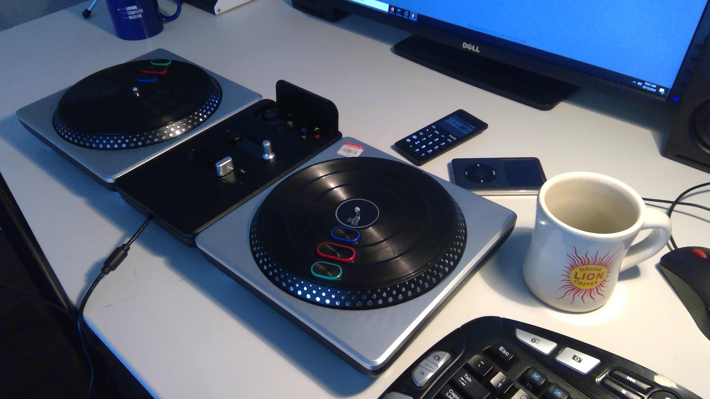

# BisqueJockey
Before long you'll be making lo-fi beats with the best of 'em. 
See it in action <a href="https://twitter.com/thehunterirving/status/1073760277491937281">here</a>!

### Prereqs
- Python 3
- <a href="https://www.tobias-erichsen.de/software/loopmidi.html">loopMIDI</a> (to create a virtual MIDI port)

### Suggested Supplimentary Content

- <a href="https://digitaldjtools.net/samples/classic-scratch-samples/">Classic scratch samples</a>
- <a href="https://www.youtube.com/watch?v=4I3CovIKJWE">Scratch: Hip Hop Turntablism Documentary</a>
